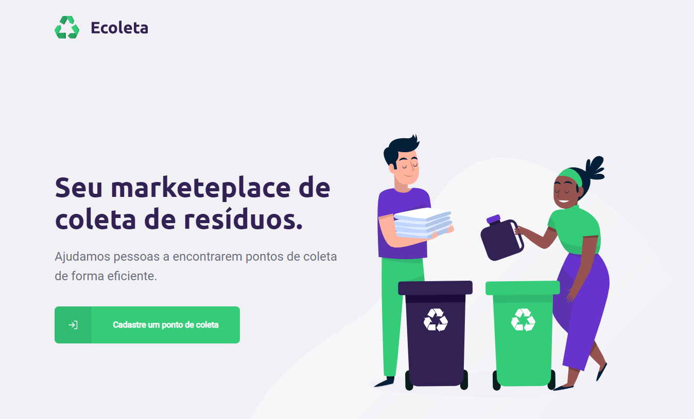
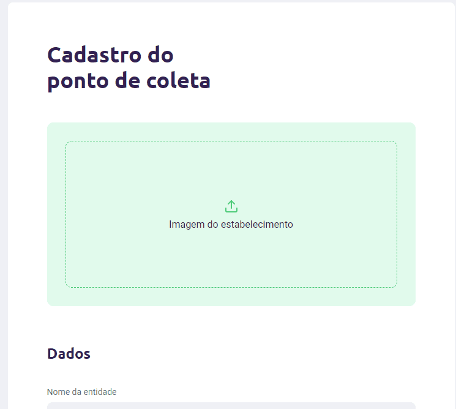

# eco-web

> Front-end code for the Ecoleta project, featured by Next Level Week. Made with React and React Hooks. :recycle:

This repository is my first contact with Reacr on the front end, i have always worked with Angular, and i was surprised by the simplicity that `React` provides to create user interfaces.

## :computer: Final Result

    

# :pushpin: Contents

- [Features](#rocket-features)
- [Getting Started](#runner-getting-started)
- [Technologies](#postbox-technologies)
- [License](#closed_book-license)

# :rocket: Features

The web app provides a home and a create point page.

    

# :runner: Getting Started

To run this server, install node and inside the server directory, do:

- Run `npm install` to install the dependencies.
- Run `npm start` and go to `http://localhost:3000`.

# :postbox: Technologies

- [React](https://pt-br.reactjs.org/): A JavaScript library for building user interfaces.
- [Leaflet](https://leafletjs.com/): Leaflet is the leading open-source JavaScript library for mobile-friendly interactive maps.

# :closed_book: License

Released in 2020, featured by Next Level Week #1.
